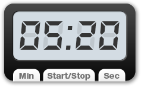
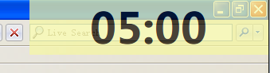

# PPT 计时器


[下载](https://github.com/old9/ppttimer/releases)

一个 Windows 下简易的 PowerPoint 计时器，基于 [Autohotkey](http://autohotkey.com)。主要功能：
* PPT 或任何全屏程序开始播放时，自动开始倒计时，结束放映或退出全屏时自动停止。
* 悬浮于最上层，鼠标可穿透，不影响其他操作。
* 字体和透明等可通过参数调节。
* 可手动开始停止计时器。

代码基于 [Yet Another CountDown Script](http://www.autohotkey.com/board/topic/19679-yet-another-countdown-script/) 修改，并参考了 [Countdown timer app](http://www.autohotkey.com/board/topic/57463-countdown-timer-app/)。

屏幕截图：



## 安装使用方法

无需安装，[下载](https://github.com/old9/ppttimer/releases)并解压，运行 ppttimer.exe 即可开始使用。

程序启动后会自动侦测 PPT 或其他全屏播放程序，一旦有全屏程序播放，则会自动启动计时器。

也可以通过预设快捷键手动启动计时器，默认的快捷键设置为：

* 开始计时 `F12`
* 停止计时 `Ctrl`+`F12`
* 在所有显示器显示计时器 `Ctrl`+`Windows`+`A`
* 将计时器移动到下一个显示器 `Ctrl`+`Windows`+`M`
* 载入计时预设 `Ctrl`+`Windows`+`F1`~`F9`
* 载入默认设置 `Ctrl`+`Windows`+`F10`
* 退出程序 `Windows`+`ESC`
 
系统托盘菜单提供更多功能，也可按下Ctrl键时右键点击计时器窗口呼出快捷菜单。

更多设置可通过 `ppttimer.ini` 配置文件设定。

## ini 参数配置说明

ini文件使用编码 `UTF-16LE-BOM` 以支持 Unicode，具体设置项可参考注释。

```

[Main]
;时间设置
;倒计时时间，单位秒，默认为 1200 秒即 20 分钟。
Duration=1200
;提前提醒时间，单位秒。默认为 120 秒即 2 分钟。
Ahead=120

;提醒设置
;提前提醒时是否播放声音及声音路径
PlayWarningSound=1
WarningSoundFile=.\beep.mp3
PlayFinishSound=1
FinishSoundFile=.\applause.mp3

;窗口样式
;透明度
opacity=180
;窗口背景色
backgroundColor=FFFFAA
;窗口大小，位置固定在右上角
width=200
height=60

;字体样式
fontface=Microsoft Yahei
fontweight=bold
fontsize=24
textcolor=000000

;提前提醒时的字体颜色
AheadColor=9D1000

;超时后的字体颜色
timeoutColor=FF0000


[Profile_1]
; 多组计时
; 可使用 Profile_N 的方式命名，最多 9 组
; 采用覆盖 Main 中设置的方式配置，Main 中选项都适用于 Profile 中

; 配置名称，可选，将显示为菜单名
name=10分钟

Duration=600
Ahead=60
PlayWarningSound=0
PlayFinishSound=1

[Profile_2]
name=1小时
Duration=3600
Ahead=300

[Profile_3]
name=10秒测试
Duration=10
Ahead=3

[Profile_4]
name=样式示例
opacity=200
fontface=Bahnschrift
fontweight=bold
fontsize=32
width=250
height=80
textcolor=001E5E
backgroundColor=A5EFFF

[Profile_5]
name=隐藏
opacity=0
Duration=72000
PlayWarningSound=0
PlayFinishSound=0

[Status]
; 会保存状态的设定

;手动模式计时，是否屏蔽自动检测计时功能
manualModeSupressDetection=1
;在所有显示器显示
showOnAllMonitors=0
;最后一次显示的显示器
lastMonitor=1
;当前启用的配置，0为默认配置
lastProfile=0

[shortcuts]
;快捷键设置，^ Ctrl，# Windows，+ Shift，! Alt。
;开始手动计时
startKey=F12
;停止计时器
stopKey=^F12
;移动到下一个显示器
moveKey=^#M
;切换在所有显示器显示
allMonitorKey=^#A
;退出主程序
quitKey=#ESC
```

## 编译方法
* 至 [Autohotkey 主页](https://autohotkey.com) 下载 Autohotkey 并安装。
* 使用安装后自带的编译打包工具 `Compiler\Ahk2Exe.exe` 编译 ahk 文件。

## TODO

* 更多可控制的参数

## licence

Licensed under the MIT.